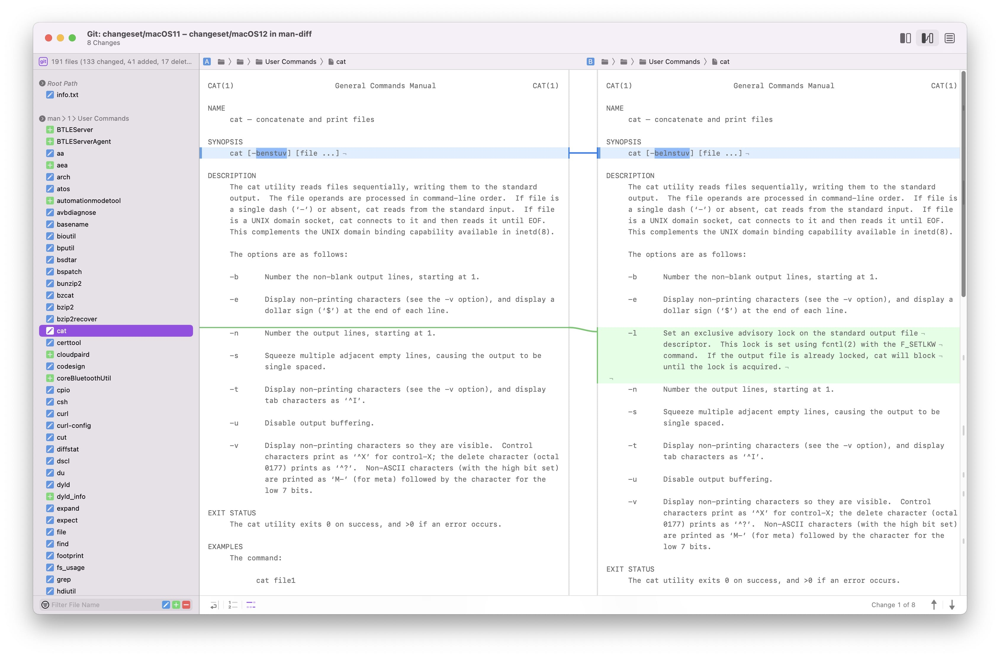
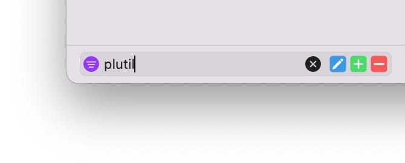
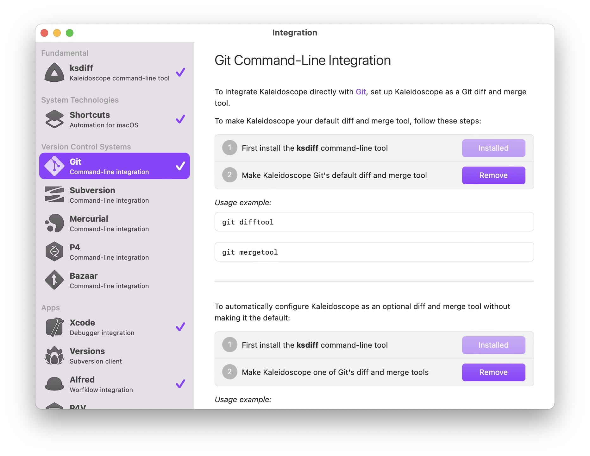

<a href="https://kaleidoscope.app"></a>

# What's up, man(1)? 

<div clear="all" />

### Find differences in man pages starting with macOS Big Sur 11.6.



## Introduction

The other day we found a helpful command line tool option, only to discover later that the option was only available in macOS Monterey. Since we also need to target Big Sur, this would not be an option for us. So we created something to help us overcome similar issues in the future: a way to compare man pages between macOS system versions.

Read the full blog post here: [What’s new in the macOS Monterey command line](https://blog.kaleidoscope.app/2021/10/25/whats-new-in-the-macos-monterey-command-line/)

## Usage

Clone repository:
```
git clone https://github.com/kaleidoscope-app/man-diff.git
```

Execute the included man-diff shell script:

```
./man-diff.sh -all
```

This will open a document like the screenshot above in Kaleidoscope.



Use the search field in the lower left to filter command names. The Modified, Added and Deleted buttons can be used to exlude that kind of change.

Or quickly lookup a single man page: 

```
./man-diff.sh plutil
```

## Changelog


May 19, 2023:
* Added macOS 13.4:  
  ```git difftool changeset/macOS13.3..changeset/macOS13.4```


Mar 28, 2023:
* Added macOS 13.3:  
  ```git difftool changeset/macOS13.2.1..changeset/macOS13.3```
* No changes in macOS 13.2.1

Jan 24, 2023:
* Added macOS 13.2:  
  ```git difftool changeset/macOS13.1..changeset/macOS13.2```

Jan 12, 2023:
* Added macOS 13.1:  
  ```git difftool changeset/macOS13.0..changeset/macOS13.1```
* No changes in macOS 13.0.1

Oct 24, 2022:

* Added macOS 13.0 which includes 611 changed files of which 331 are perl related version changes:
  * We post processed the changeset and grouped perl related changes:  
    ```git difftool changeset/macOS12.6-post-processed..changeset/macOS13.0```
  * To see all changes you can do so with:  
    ```git difftool changeset/macOS12.6..changeset/macOS13.0```
    
Oct 20, 2022:

* Added macOS 12.6:  
  ```git difftool changeset/macOS12.5..changeset/macOS12.6```
    
Aug 10, 2022:

* Added macOS 12.5:  
  ```git difftool changeset/macOS12.4..changeset/macOS12.5```
  
May 16, 2022:

* Added macOS 12.4:  
  ```git difftool changeset/macOS12.3..changeset/macOS12.4```

Mar 15, 2022:

* Added macOS 12.3:
  * We post processed the changeset and grouped buildins changes:  
    ```git difftool changeset/macOS12.2-post-processed..changeset/macOS12.3```
  * To see all changes you can do so with:  
    ```git difftool changeset/macOS12.2..changeset/macOS12.3```

Jan 29, 2021:

* Added macOS 12.2:  
  ```git difftool changeset/macOS12.1..changeset/macOS12.2```

Dec 14, 2021:

* Added macOS 12.1:  
  ```git difftool changeset/macOS12..changeset/macOS12.1```
* Removed man page footer to simplify diff

## Prerequisites

git and diff tool of your choice. Of course we recommend Kaleidoscope.

* Install [Kaleidoscope for Mac](https://kaleidoscope.app)
* In Kaleidoscope, select Kaleidoscope > Integration from the menu
* If needed, click the Install buttons for ksdiff and Git



## Feedback

We’d [love to hear](mailto:support@kaleidoscope.app?Subject=man-diff%20Feedback) if you find this useful or have ideas for improvements.

### Notes

We post processed the default changeset so it is easier to digest, ignoring changes to Perl (spanning 494 files), macOS name changes and text reformatting.

If you want to see all changes you can do so with:

```
git difftool macOS/11.6..macOS/12.0.1
```
